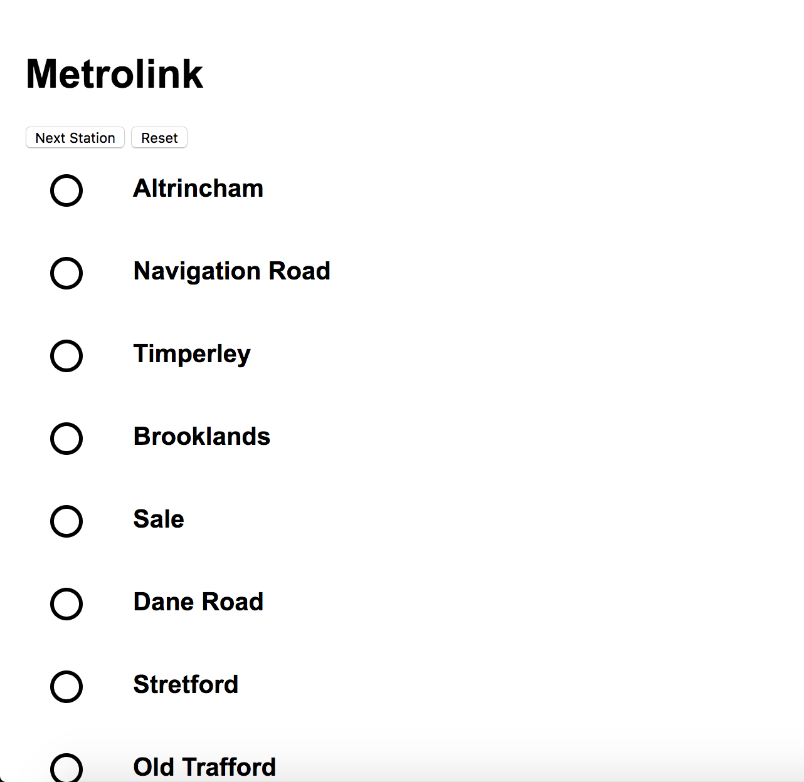
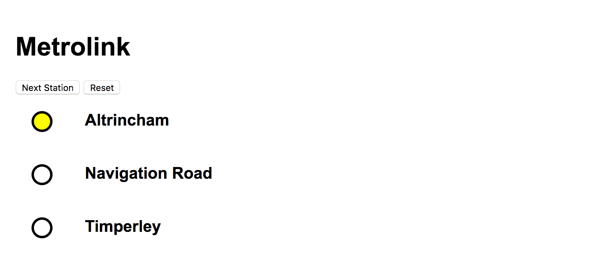

:twisted_rightwards_arrows: Switch Driver/Navigator roles, if you haven't already done so.

## Displaying a Route on the DOM

We've now created a new instance of `Route` and we've added several instances of `Station` to it. Now we want to utilise the `.getStations()` method on the `Route` prototype, as well as jQuery's `.each` method, to output our route's stations to the DOM.

1) Create a new `$.each` statement that takes `altrinchamToAshtonUnderLyne.getStations()` as its first argument, and an anonymous function with the parameters `stationIndex` and `station` as its second argument:

```js
$.each(altrinchamToAshtonUnderLyne.getStations(), function (stationIndex, station) {

})
```

2) Inside our anonymous function we want to define a variable called `stationHTML` and we will assign it some HTML with our station name (`station.getName()`):

```js
$.each(altrinchamToAshtonUnderLyne.getStations(), function (stationIndex, station) {
  var stationHTML = '<div class="station">'
  stationHTML += '<div class="circle"></div>'
  stationHTML += '<div class="name">' + station.getName() + '</div>'
  stationHTML += '</div>'
})
```

3) Finally, right before we close our function block, we want to append the value of `stationHTML` to our DOM with `$(<css_selector>).append(<html_to_append>)`:

```js
$.each(altrinchamToAshtonUnderLyne.getStations(), function (stationIndex, station) {
  var stationHTML = '<div class="station">'
  stationHTML += '<div class="circle"></div>'
  stationHTML += '<div class="name">' + station.getName() + '</div>'
  stationHTML += '</div>'

  $('#stations').append(stationHTML)
})
```

4) Save your files and open up your **index.html** in Chrome. You should see:



## Displaying the current station

It would be great if our application could show us the station where our `Tram` currently is. We have a variant of our CSS `circle` class called `-current`, which we will use to indicate the current station.

1) Inside our second `$.each` method call, before we define `stationHTML`, add a new variable called `css` and assign it an empty string (`''`). 

```js
$.each(altrinchamToAshtonUnderLyne.getStations(), function (stationIndex, station) {
  var css = ''

  var stationHTML = '<div class="station">'
  stationHTML += '<div class="circle"></div>'
  stationHTML += '<div class="name">' + station.getName() + '</div>'
  stationHTML += '</div>'

  $('#stations').append(stationHTML)
})
```

2) Underneath, create a new `if` statement. We want to check that `tram.getCurrentStation()` is strictly equal to `station`. If it is, then we'll set `css`'s value to `-current`:

```js
$.each(altrinchamToAshtonUnderLyne.getStations(), function (stationIndex, station) {
  var css = ''

  if (tram.getCurrentStation() === station) {
    css = '-current'
  }

  var stationHTML = '<div class="station">'
  stationHTML += '<div class="circle"></div>'
  stationHTML += '<div class="name">' + station.getName() + '</div>'
  stationHTML += '</div>'

  $('#stations').append(stationHTML)
})
```

3) Lastly, use string concetenation to add the `-current` class after `circle`:

```js
$.each(altrinchamToAshtonUnderLyne.getStations(), function (stationIndex, station) {
  var css = ''

  if (tram.getCurrentStation() === station) {
    css = '-current'
  }

  var stationHTML = '<div class="station">'
  stationHTML += '<div class="circle ' + css + '"></div>'
  stationHTML += '<div class="name">' + station.getName() + '</div>'
  stationHTML += '</div>'

  $('#stations').append(stationHTML)
})
```

4) Save and view in Chrome. Your first station should now show highlighted yellow:



## Add, commit and push.

:twisted_rightwards_arrows: **Switch Driver/Navigator roles.**

[Continue to part 3](lesson2_page3.md)